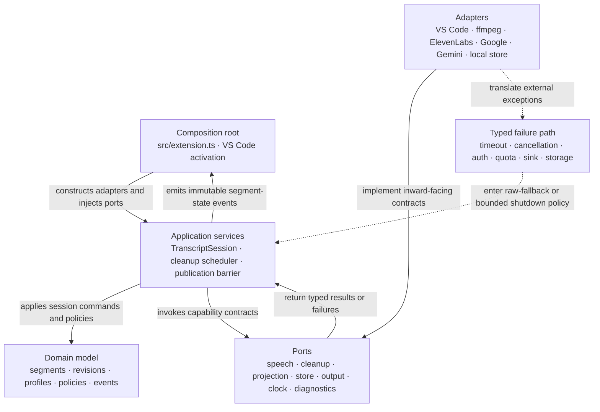
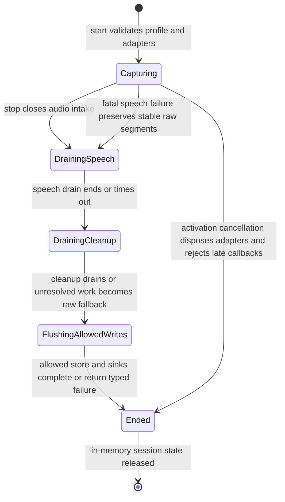

# Voice Scribe should evolve through typed ports around one session core

## The design combines ports-and-adapters with a transcript pipeline

The domain core owns Transcript Session lifecycle, stable Transcript Segment identity, ordered state transitions, and publication policy. Application services coordinate the pipeline through ports. Adapters own VS Code, speech providers, cleanup models, child processes, persistent storage, and output destinations. Dependencies point inward; provider callbacks become typed domain inputs before any projection or persistence observes them.



The diagram is a dependency rule, not only a runtime picture. Domain and application modules may not import VS Code, provider SDKs, Node child-process APIs, or a concrete storage library.

## Binding decisions prevent parallel implementations from drifting

### `AD-SESSION-OWNER` makes Transcript Session the sole lifecycle authority

- **Binds:** `FR-CLEANUP-CONCURRENCY`, `FR-PROJECTION-ORDER`, `FR-MODE-PROFILE`, `FR-INCOGNITO`, `NFR-RELIABILITY`
- **Prevents:** Multiple adapters independently starting, stopping, draining, or disposing work and accepting late callbacks after session end.
- **Rule:** One `TranscriptSession` instance owns one immutable session identity, lifecycle state, cancellation scope, Mode Profile snapshot, privacy policy snapshot, and ordered segment registry. A session reducer is the only writer of semantic session, segment, cleanup-attempt, publication, and selected-representation state. Schedulers and barriers own operational indexes only and submit typed outcomes to the reducer; adapters never mutate session state directly.

### `AD-IMMUTABLE-PROVENANCE` keeps Raw Text separate from every derived revision

- **Binds:** `FR-CLEANUP-VOICE`, `FR-PROJECTION-STATE`, `FR-NOTE-STORE`, `FR-TASK-SPEC`, `NFR-RELIABILITY`
- **Prevents:** A cleanup result overwriting source speech, making comparison, fallback, audit, or recovery impossible.
- **Rule:** Transcript Session assigns an immutable monotonic `segmentSequence` when provider input becomes stable. A stable Transcript Segment stores immutable Raw Text and zero or more immutable Cleanup Revisions; `segmentSequence` is the only publication-order key. Projection selects a versioned representation by reference and never mutates Raw Text.

### `AD-SESSION-STABILIZATION` normalizes provider input before domain publication

- **Binds:** `FR-CLEANUP-ADAPTER`, `FR-PROJECTION-STATE`, `FR-PROJECTION-ORDER`, `NFR-RELIABILITY`
- **Prevents:** Speech adapters disagreeing about segment identity, stabilization, deduplication, or whether a late correction may alter Raw Text.
- **Rule:** The speech port emits session-scoped ephemeral partial input or stable input with an adapter deduplication identity. Transcript Session alone converts stable input into segment identity, `segmentSequence`, and immutable Raw Text. Partial input is never stored or cleaned. Duplicate stable input is rejected, and a provider correction after stabilization becomes a typed unsupported correction or an explicitly new segment; it never mutates Raw Text.

### `AD-CAPABILITY-PORTS` isolates every external capability

- **Binds:** `FR-CLEANUP-ADAPTER`, `FR-NOTE-STORE`, `FR-OUTPUT-SINK`, `NFR-MAINTAINABILITY`
- **Prevents:** Model, storage, and destination branches accumulating in `extension.ts` or domain modules.
- **Rule:** Speech, cleanup, projection, storage, output, time, and diagnostics are TypeScript interfaces defined inward of their adapters. Factories and registries compose capabilities at activation.

### `AD-TYPED-SEGMENT-EVENTS` makes one event stream authoritative

- **Binds:** `FR-PROJECTION-STATE`, `FR-PROJECTION-ORDER`, `FR-NOTE-STORE`, `FR-OUTPUT-SINK`, `NFR-OBSERVABILITY`
- **Prevents:** The panel, editor, and store deriving incompatible states from provider-specific callbacks.
- **Rule:** After the reducer commits a valid transition, Transcript Session emits one immutable canonical envelope containing session identity, monotonic session event sequence, semantic event type, entity identity, and entity or representation version. Projection and Output Sinks consume publication events or the read model derived from them; Note Store applies writes idempotently by session, entity, and version. No consumer subscribes to provider callbacks or cleanup-completion callbacks directly, and duplicate or stale envelopes are harmless.

### `AD-BOUNDED-CLEANUP` makes concurrency a session policy

- **Binds:** `FR-CLEANUP-CONCURRENCY`, `NFR-LATENCY`, `NFR-RELIABILITY`
- **Prevents:** Unbounded requests, memory growth, cost spikes, and shutdown that waits indefinitely.
- **Rule:** A cleanup scheduler owns an explicit concurrency cap, bounded pending capacity, cancellation, per-request timeout, and session-stop drain window. Stable-segment admission never blocks speech. When capacity is full, the session records terminal `skipped-capacity`, selects Raw Text, releases the publication barrier, and emits content-free saturation evidence. No policy may discard a segment or leave it non-terminal. Capacity values are validated before recording and set from measured behavior rather than embedded across adapters.

### `AD-ORDERED-PUBLICATION` separates work completion from visible publication

- **Binds:** `FR-CLEANUP-ORDER`, `FR-PROJECTION-ORDER`, `SM-ORDERING-INTEGRITY`
- **Prevents:** Fast later rewrites overtaking slow earlier segments or duplicate late results changing published text.
- **Rule:** Initial cleanup completion records a terminal outcome against `segmentSequence`. A single Ordered Publication Barrier advances only across consecutive sequence values with terminal initial outcomes and emits one initial selected representation per segment. A later retry never re-enters or rewinds the barrier; success emits an in-place representation change with a strictly increasing representation version only to projections and sinks that advertised amendment support.

### `AD-RAW-FALLBACK` makes degradation deterministic

- **Binds:** `FR-CLEANUP-ADAPTER`, `FR-CLEANUP-ORDER`, `FR-PROJECTION-STATE`, `FR-OUTPUT-SINK`, `NFR-RELIABILITY`
- **Prevents:** Cleanup outage stopping capture, leaving a permanent spinner, or silently losing a stable segment.
- **Rule:** Timeout, cancellation, quota, authentication, safety, provider, and malformed-output failures become typed terminal outcomes whose selected representation is Raw Text. Retry creates a new immutable attempt and, after initial publication, may only advance the representation version under `AD-ORDERED-PUBLICATION`.

### `AD-INCOGNITO-AT-STORE-BOUNDARY` turns privacy into an enforceable capability absence

- **Binds:** `FR-INCOGNITO`, `FR-NOTE-STORE`, `FR-TASK-SPEC`, `NFR-PRIVACY`, `NFR-OBSERVABILITY`
- **Prevents:** A new feature accidentally persisting an incognito session through notes, task outputs, caches, diagnostics, or recovery checkpoints.
- **Rule:** The composition root registers every capability with a durable-side-effect classification and resolves privacy as a deny-dominant intersection with the Mode Profile. Incognito forbids extension-managed retention, cache, recovery, persistent diagnostics, automatic file creation, and background export; unknown durability fails closed. The explicitly selected visible editor or terminal delivery may remain allowed as the user's active output, but it cannot create hidden history or automatic save. Tests enumerate the capability registry and inspect every durable adapter, not only `NoteStore`.

### `AD-PROFILE-SNAPSHOT` makes each session behavior stable

- **Binds:** `FR-CLEANUP-VOICE`, `FR-MODE-PROFILE`, `FR-TASK-SPEC`, `FR-INCOGNITO`
- **Prevents:** Mid-session settings changes producing mixed prompts, retention behavior, or destinations inside one transcript.
- **Rule:** Recording start resolves and snapshots immutable Mode Profile and Voice Profile values with schema version, stable identity, content hash, provider capabilities, persistence policy, and Output Sink capabilities. Authentication is resolved while constructing adapters; credentials and credential references never enter requests, session events, snapshots, diagnostics, or Note Store records. A change that affects the snapshot starts a new session boundary.

### `AD-BOUNDED-LIFECYCLE` preserves the current serialized lifecycle discipline

- **Binds:** `FR-CLEANUP-CONCURRENCY`, `FR-OUTPUT-SINK`, `NFR-RELIABILITY`
- **Prevents:** Overlapping start and stop, unbounded drains, stale events, child-process leaks, or double disposal.
- **Rule:** Session lifecycle commands remain serialized and idempotent. Extension scope owns reusable factories, authenticated SDK clients, model registries, and prewarm resources; session scope owns streams, requests, timers, audio processes, and subscriptions. Stop ends audio intake, drains speech within a bound, drains or cancels cleanup within a bound, publishes raw fallback for unresolved stable segments, flushes allowed storage, and disposes session handles only. Extension deactivation disposes shared clients after sessions end. Every callback carries session-handle identity and is rejected after that handle becomes terminal.

### `AD-CONTENT-FREE-DIAGNOSTICS` separates health evidence from user content

- **Binds:** `NFR-PRIVACY`, `NFR-SECURITY`, `NFR-OBSERVABILITY`, `SM-CLEANUP-LATENCY`
- **Prevents:** Transcript, prompt, credential, audio, or note content leaking through logs and metrics.
- **Rule:** Diagnostics accept only event name, monotonic timing, queue counts, model or provider category, state transition, and typed error category. Diagnostic types expose no content-bearing field. Persistent diagnostics are disabled for Incognito by default.

### `AD-OUTPUT-AT-EDGE` keeps destination behavior outside the session core

- **Binds:** `FR-OUTPUT-SINK`, `FR-TASK-SPEC`, `NFR-MAINTAINABILITY`
- **Prevents:** Editor, terminal, panel, and future standalone behavior forking capture and cleanup logic.
- **Rule:** Output Sinks advertise `livePartial`, `amendPublishedSegment`, `revertToRaw`, `emitDerivedDocument`, and `durableSideEffect` capabilities. Mode Profile validation rejects incompatible behavior before recording. An append-only sink waits for the ordered terminal representation or operates under an explicit raw-only profile. Delivery carries an idempotency key derived from session, entity, and representation version. Sink failure leaves the live session read model and Raw Text intact.

### `AD-SINGLE-SEGMENT-CLEANUP` fixes cleanup replacement scope

- **Binds:** `FR-CLEANUP-ADAPTER`, `FR-CLEANUP-VOICE`, `FR-CLEANUP-ORDER`, `NFR-RELIABILITY`
- **Prevents:** One adapter rewriting a segment while another splits, merges, deletes, reorders, or rewrites a multi-segment context window.
- **Rule:** Each cleanup request targets exactly one stable segment and carries immutable Raw Text, a resolved Voice Profile snapshot, and optional bounded read-only context retaining source segment identities. A successful result replaces only the target representation and carries content-free model metadata. Cross-segment restructuring belongs to a derived-document composer after session finalization.

### `AD-TERMINAL-SNAPSHOT` gives storage and derived documents one final source

- **Binds:** `FR-TASK-SPEC`, `FR-NOTE-STORE`, `NFR-RELIABILITY`
- **Prevents:** Task Spec and Note Store observing different terminal content or persistence racing unresolved cleanup fallback.
- **Rule:** After speech drain and cleanup drain or fallback resolution, the session reducer freezes an immutable terminal snapshot containing ordered segment sequence, Raw Text, selected revision references, attempt outcomes, effective profile references, and terminal status. Task Spec consumes only this snapshot. Allowed incremental recovery records are versioned and idempotent, while the terminal snapshot is authoritative and supersedes lower-version state.

### `AD-SUPPORTED-DEPENDENCY-TUPLE` qualifies stack preservation by security and upstream support

- **Binds:** `NFR-SECURITY`, `NFR-MAINTAINABILITY`, all adapters
- **Prevents:** Treating a runnable lockfile as acceptable when a bundled dependency has a known high-severity advisory or the compiler and lint tools are outside their supported compatibility matrix.
- **Rule:** Preserve shipped behavior, not vulnerable or unsupported resolutions. Before feature implementation, bundled runtime dependencies must have no unresolved known high-severity advisory unless a documented reachability review and Daniel-approved exception exists. TypeScript, ESLint, parser, and plugin versions move as one officially supported tuple and pass compile, lint, tests, and bundle checks together.

### `AD-HOST-COMPATIBILITY-FLOOR` makes the VS Code engine declaration testable

- **Binds:** `NFR-MAINTAINABILITY`, `NFR-ACCESSIBILITY`, VS Code projection and Output Sinks
- **Prevents:** Compiling against newer VS Code or Node APIs while claiming compatibility with a host that does not provide them.
- **Rule:** `engines.vscode`, `@types/vscode`, `@types/node`, and the extension-host test matrix describe one explicit minimum supported host. The types may not exceed that floor without raising the manifest floor, and the packaged extension must smoke-test on the declared minimum and a current supported host.

### `AD-FFMPEG-CAPABILITY-PROBE` makes the unbundled audio runtime an explicit contract

- **Binds:** `NFR-RELIABILITY`, `NFR-MAINTAINABILITY`, audio capture adapter
- **Prevents:** Accepting any executable that returns a version while discovering unsupported platform input formats only after recording fails.
- **Rule:** Activation or recording setup probes the required ffmpeg executable and the platform input capability for `avfoundation`, `alsa`, or `dshow`. The project records a supported operating-system and capability matrix, returns typed setup failure, and never assumes the reviewing machine's ffmpeg version is the product minimum.

## Conventions make independent adapters interoperable

| Concern | Convention |
|---|---|
| Identity | Opaque session, segment, revision, and attempt identifiers are generated at their owner boundary and never derived from transcript content or array position. `segmentSequence` is allocated monotonically at stabilization and is the sole capture-order key. |
| Time | Store instants as UTC ISO 8601 strings and durations as integer milliseconds; inject a clock for tests. |
| Events | Use discriminated TypeScript unions inside a canonical post-commit envelope with session event sequence, entity identity, and entity or representation version. Consumers must be idempotent to duplicate and stale delivery. |
| Failures | Return typed domain failure categories at ports; preserve provider details only as non-content diagnostic metadata. |
| State mutation | Only the Transcript Session reducer mutates semantic aggregate state. Scheduler and barrier own operational indexes and submit typed outcomes; consumers receive snapshots or immutable events. |
| Configuration | Validate provider, Mode Profile, Voice Profile, retention, concurrency, and timeout configuration before recording begins. |
| Logging | Log lifecycle and content-free measurements; never Raw Text, Cleanup Revision, audio, credentials, note content, or full prompts. |
| Persistence | Store Raw Text and Cleanup Revisions separately with schema version, resolved profile identity and content hash, provider and model identifiers, timing, and terminal status. Apply writes idempotently by session, entity, and version; the frozen terminal snapshot supersedes recovery state. |
| Tests | Deterministic fakes control clock, completion order, timeout, cancellation, and durable writes; randomized scheduler tests assert ordering invariants. |

## The stack inventory distinguishes shipped evidence from acceptance status

| Capability | Current declaration or resolution | Pin meaning | Evidence source | Acceptance status |
|---|---|---|---|---|
| TypeScript | 5.9.3 | Exact lock resolution | `package-lock.json` | Runnable but blocked as a tuple with unsupported typescript-eslint 6.21.0 |
| ESLint | 8.57.1 | Exact lock resolution | `package-lock.json` | End-of-life line; replace with the parser and plugin as one supported tuple |
| typescript-eslint parser and plugin | 6.21.0 | Exact lock resolution | `package-lock.json` | Does not support TypeScript 5.9.3 under the upstream version matrix |
| Node.js CI | 22 | Floating CI major | `.github/workflows/ci.yml` | Supported LTS line; not evidence of the VS Code extension-host runtime |
| VS Code extension engine | ^1.85.0 | Declared minimum host | `package.json` | Unproven because API and Node types resolve above the claimed floor |
| VS Code API types | 1.109.0 | Exact lock resolution from `^1.85.0` | `package-lock.json` | Must align with the chosen minimum host or the host floor must rise |
| Node API types | 20.19.35 | Exact lock resolution | `package-lock.json` | Must align with the chosen extension-host floor |
| esbuild | 0.27.3 | Exact lock resolution | `package-lock.json` | Build succeeds; maintenance update is optional |
| Mocha | 10.8.2 | Exact lock resolution | `package-lock.json` | Test suite passes; major update is maintenance work |
| Sinon | 17.0.1 | Exact lock resolution | `package-lock.json` | Test suite passes; major update is maintenance work |
| ElevenLabs WebSocket client | ws 8.19.0 | Bundled exact lock resolution | `package-lock.json`, bundle inspection | Blocked by known high-severity advisory; lock 8.21.0 or newer and re-audit |
| Google Speech-to-Text client | @google-cloud/speech 7.4.0 | Bundled exact lock resolution | `package-lock.json`, bundle inspection | Refresh and re-audit affected transitive protobuf resolution |
| ffmpeg | Unbundled system executable | Capability requirement, not an exact version | `src/audioCapture.ts` | Platform capability and support matrix are not yet defined |
| BMAD Method | 6.10.0 | Installed stable release | `_bmad/_config/manifest.yaml`, live npm verification | Accepted |
| BMAD TEA | 1.19.1 | Installed stable release | `_bmad/_config/manifest.yaml`, live npm verification | Accepted |
| Initial cleanup model | gemini-3.6-flash | Service-side stable model identifier | Official Google model documentation | Accepted as a candidate; reverify availability and quota before implementation |

No Gemini SDK is selected in this spine. Authentication and SDK choice remain deferred; adding an unverified dependency here would falsely bind implementation. Full official-source evidence and advisory links live in [the technology reality review](review-technology-reality.md).

## The structural seed extracts the domain without a flag-day rewrite

```text
src/
  domain/
    transcriptSession.ts       # lifecycle aggregate and segment registry
    transcriptSegment.ts       # immutable raw provenance and derived revisions
    profiles.ts                # validated mode, voice, privacy, and output snapshots
    events.ts                  # discriminated session and segment events
  application/
    cleanupScheduler.ts        # bounded work admission and cancellation
    orderedPublication.ts      # terminal-outcome barrier
    taskSpecComposer.ts        # structured output from published session state
  ports/
    transcriptionProvider.ts   # migrated existing speech contract
    cleanupProvider.ts         # model-neutral cleanup contract
    transcriptProjection.ts    # live surface contract
    noteStore.ts               # persistence contract including no-write adapter
    outputSink.ts              # editor, terminal, and future destinations
    diagnostics.ts             # content-free health contract
  adapters/
    speech/                    # existing ElevenLabs and Google adapters
    cleanup/                   # Gemini adapter and deterministic fake
    vscode/                    # composition, projection, editor and terminal sinks
    storage/                   # local store, schema migration, and no-write adapter
  extension.ts                 # activation and composition root only
```

The migration begins by wrapping current callbacks and editor operations behind ports while preserving behavior. Session state then moves from `extension.ts` into the domain aggregate. Cleanup, storage, and new Mode Profiles build only after the extracted seams have characterization tests.

## Capabilities have one home and one governing rule set

| Capability or area | Lives in | Governed by |
|---|---|---|
| Transcript lifecycle | `domain/transcriptSession.ts` | `AD-SESSION-OWNER`, `AD-SESSION-STABILIZATION`, `AD-BOUNDED-LIFECYCLE` |
| Raw provenance and revisions | `domain/transcriptSegment.ts` | `AD-IMMUTABLE-PROVENANCE`, `AD-SINGLE-SEGMENT-CLEANUP` |
| Provider-neutral cleanup | `ports/cleanupProvider.ts`, `adapters/cleanup/` | `AD-CAPABILITY-PORTS`, `AD-RAW-FALLBACK` |
| Concurrent cleanup | `application/cleanupScheduler.ts` | `AD-BOUNDED-CLEANUP` |
| Ordered visibility | `application/orderedPublication.ts` | `AD-ORDERED-PUBLICATION`, `AD-TYPED-SEGMENT-EVENTS` |
| Live preview | `ports/transcriptProjection.ts`, `adapters/vscode/` | `AD-TYPED-SEGMENT-EVENTS`, `AD-OUTPUT-AT-EDGE` |
| Mode and Voice Profiles | `domain/profiles.ts` | `AD-PROFILE-SNAPSHOT` |
| Task Spec | `application/taskSpecComposer.ts`, output adapter | `AD-IMMUTABLE-PROVENANCE`, `AD-OUTPUT-AT-EDGE` |
| Local notes | `ports/noteStore.ts`, `adapters/storage/` | `AD-IMMUTABLE-PROVENANCE`, `AD-CAPABILITY-PORTS`, `AD-TERMINAL-SNAPSHOT` |
| Incognito | Composition and the durable-capability registry | `AD-INCOGNITO-AT-STORE-BOUNDARY`, `AD-PROFILE-SNAPSHOT` |
| Editor and terminal delivery | `ports/outputSink.ts`, `adapters/vscode/` | `AD-OUTPUT-AT-EDGE` |
| Pipeline diagnostics | `ports/diagnostics.ts` | `AD-CONTENT-FREE-DIAGNOSTICS` |
| Dependency and host compatibility | Manifest, lockfile, CI, extension-host harness | `AD-SUPPORTED-DEPENDENCY-TUPLE`, `AD-HOST-COMPATIBILITY-FLOOR` |
| Local audio prerequisite | Audio adapter and activation capability probe | `AD-FFMPEG-CAPABILITY-PROBE` |

## Failure paths preserve raw text and release owned resources



Storage failure leaves the live read model available and reports that the note was not saved. Output Sink failure leaves the selected representation in session state for copy or retry. Cleanup failure releases the publication barrier with Raw Text. Speech failure ends capture because no new source segments can be trusted. No failure path authorizes content logging.

## Deferred decisions remain outside the binding spine until confirmed

- Select Gemini authentication, billing, SDK, timeout, and quota policy after current official documentation and the user's credential preference are verified.
- Select the local persistence technology only after retention, workspace scope, encryption, deletion, and crash-recovery requirements are confirmed.
- Finalize the Task Spec schema before binding `taskSpecComposer.ts` output types.
- Finalize side-by-side versus inline projection after a narrow-and-wide VS Code prototype.
- Decide whether ElevenLabs credentials migrate to VS Code `SecretStorage` in this iteration.
- Set numeric scheduler, timeout, drain, latency, and quality thresholds from measured baseline evidence.

## Technology acceptance blockers precede feature implementation

- Lock `ws` at 8.21.0 or newer, refresh advisory-affected production transitive dependencies, rebuild, and obtain a clean production audit or a documented reachability exception.
- Select a supported TypeScript, ESLint, parser, and plugin tuple and verify the full repository checks.
- Align the VS Code engine floor with API and Node types and exercise the packaged extension on the chosen minimum host.
- Define and probe the ffmpeg capabilities required on each supported operating system.
