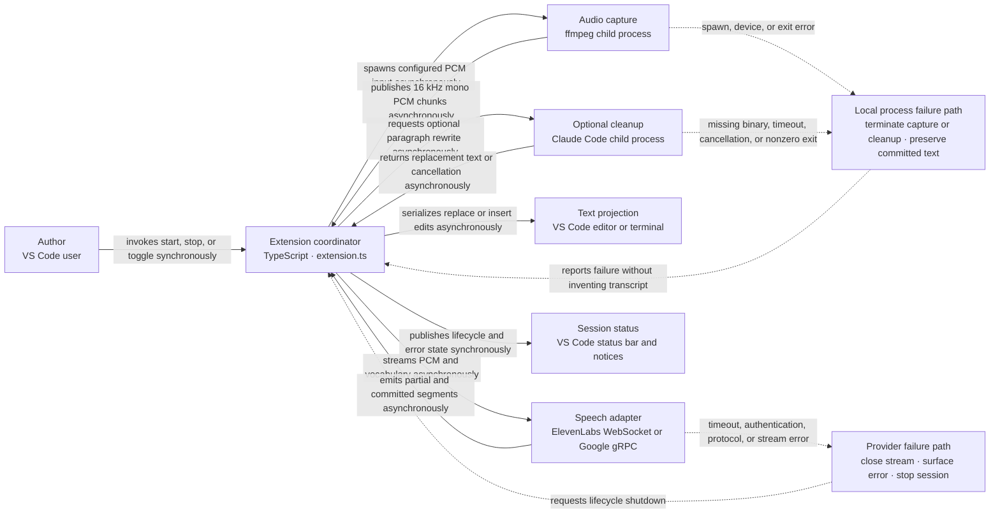

# The shipped architecture is a streaming pipeline coordinated by one extension state machine

Voice Scribe v0.6.1 is an event-driven VS Code extension. A serialized lifecycle queue protects start, stop, configuration change, and disposal transitions. During a recording session, audio capture and provider startup run concurrently; PCM chunks flow to the provider, recognition callbacks flow into a serialized editor-edit queue, and final text may pass through deterministic command transformations before insertion.

## Session state has a single owner but two serialized queues

The extension coordinator is the authoritative owner of recording state, the active provider, the `AudioCapture` process, live-range decorations, paragraph tracking, timers, and cancellation tokens. A lifecycle promise chain prevents overlapping setup and teardown. A separate editor-edit promise chain preserves recognition callback order. This separation is important: provider events may arrive rapidly while lifecycle transitions must remain atomic.

## The transcription boundary is explicit and provider-neutral

`TranscriptionProvider` exposes startup, audio submission, shutdown and drain, full-transcript retrieval, prewarming, and disposal. `providerRegistry.ts` supplies descriptors and factories for ElevenLabs and Google while recording provider capabilities such as vocabulary support. The coordinator depends on this contract rather than branching on provider names.

## Partial and final recognition use different projection semantics

An interim segment replaces a tracked live range and receives a dotted underline so the author can distinguish unstable recognition. A committed segment replaces that range, passes through filler removal and command interpretation, then updates the current paragraph or writes to the terminal. Editor operations are serialized so a later partial cannot overtake an earlier committed edit.

## Shutdown drains useful speech before resources are disposed

Stopping first ends audio capture, then asks the active provider to drain final recognition within its bounded implementation window, and finally disposes session resources. ElevenLabs waits for a final event with a bounded delay. Google completes the gRPC stream and waits for pending results with a bounded delay. Settings and provider changes trigger the same lifecycle path so stale callbacks do not mutate the editor after a session change.

## Optional Claude features are local process integrations rather than internal model clients

Paragraph polishing and repository-keyterm generation spawn the locally installed Claude Code CLI with constrained prompts and no tool access for polishing. The extension resolves the executable across supported environments, enforces cancellation and timeouts, and replaces text only after a successful result. This direct dependency is limited to Claude and is not yet a provider-neutral cleanup port.

## Cross-cutting behavior is enforced by convention and tests

Strict TypeScript, explicit cancellation, no transcript-value logging, bounded buffers, and disposal on deactivation are the main safety mechanisms. The automated suite exercises the modules with mocked VS Code, network, and child-process boundaries. There is no persistent domain model, transactional store, or distributed consistency requirement in v0.6.1.
